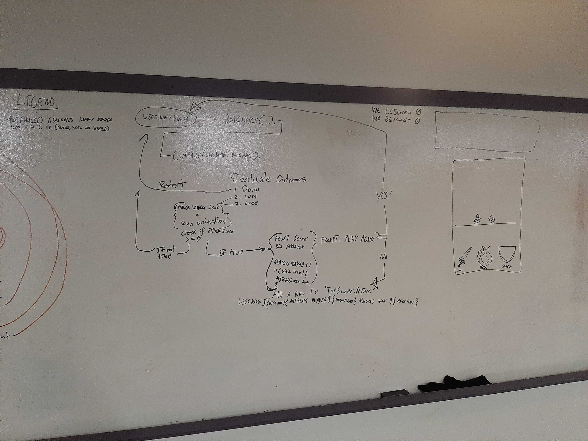

## Code Fellow 201 Final Project: _Duel of Fate_

#### Members:

Cindy Weiss, Jerome Burns, Isaac Nelson, Peter Cole

#### Description:

Fantasy rock paper scissors with HTML, CSS, Javascript

_v1 11/17/19_ - Isaac set up animation

_v2 11/18/19_ - Wireframe & Work on JS Logic and CSS and display

_v3 11/19/19_ - MVP sprint

[_User Stories_](https://github.com/ISAACLNELSON/201-Final-Project/projects/1)

